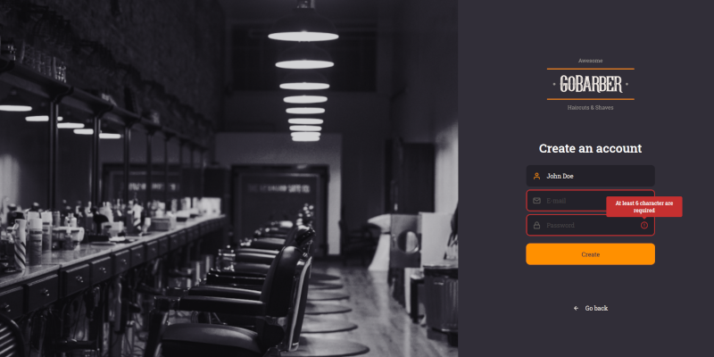
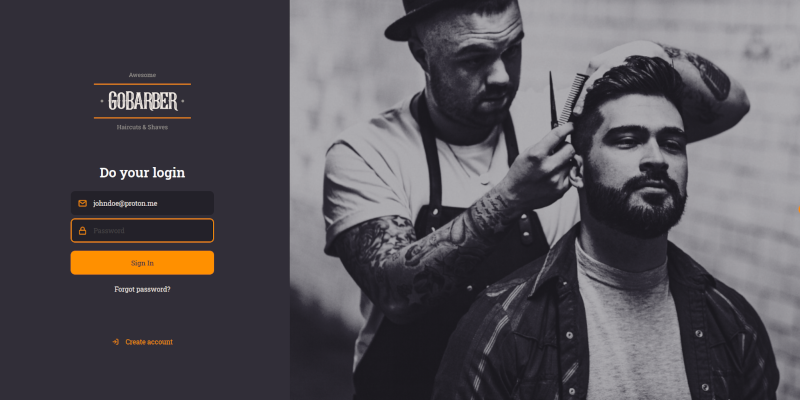
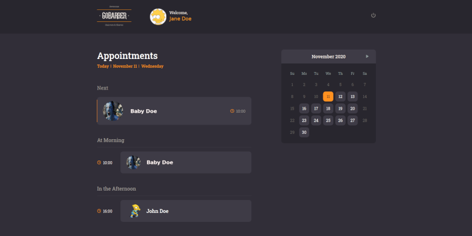
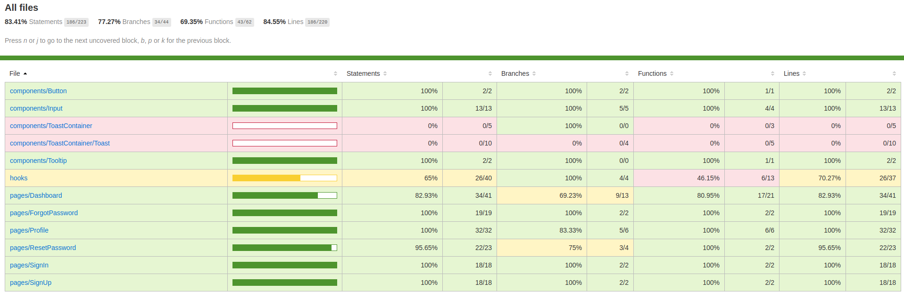

<div align="center">
	<h1>GoBarber Web 💈</h1>
</div>

GoBarber Web Application to manage barbershop scheduling, developed copying the instructor coding during the [Rocketseat's](https://rocketseat.com.br) GoStack Course.

## 💻 Features
- Sign Up
- Password recovery
- Sign In
- Profile update
- View customers appointments by day

## 📸 Screenshot
<div align="center">
	
</div>
<div align="center">
	
</div>
<div align="center">
	
</div>

## 🧰 Main languages and libraries


## 🚀 Publishing

Github Actions is being used to deploy and deliver the applications on Digital Ocean server.

## 🧪 Test Coverage Report (Jest library)



## ⚙️ Setup

1. Environment:
 - NodeJS: v12.18.0
 - Yarn: v1.22.5

2. Project
```
# clone this repo
$ git clone https://github.com/danielynx/rocketseat-gobarber-web.git

# go to project folder
$ cd rocketseat-gobarber-web

# install dependencies
$ yarn install

# Config API address on .env file

# Start React Native watcher
$ yarn start
```

## 📖 Main concepts that I learned in this project

  - Utilize useRef and useCallback react hooks.
  - I learned that react has attributes set of each html component, and using this it's possible create component that receive any native attribute.
  - Use Unform component to manage form data.
  - How Styled Components allow stylize a children component.
  - Create a React Context to share data with many components.
  - I learned that the function returned by an useEffect component will be executed as soon as the component died.
  - Another cool and useful thing that I learned was that when a set<State> method, created by useState component, receive a function instead an object, this function will receive the <State> object as parameters.
  - How animate died components with react-spring and how animate using css keyframes.
  - Create a request that has multipart/form-data content type, using FormData Javascript class.
  - Customize input file.
  - How test pages, hooks and components using **testing-library/react** and **testing-library/react-hooks** libraries:
    - Mock, spy and stub functions
    - Find on the DOM by text, placeholder and testeId.
    - Async with waitFor, waitForNextUpdate, act.
    - Use fireEvent to change value, trigger focus and blur events.
    - Test with expect, objectContaining, toHaveStyle, toHaveBeenCalledWith, toBeUndefined, toBeTruthy.
  - Create Github actions to build and deploy to the server.
  - Config Nginx and PM2 on DigitalOcean Server to delivery a ReactJS application.
  - Create SSL certification with certbot tools.
  - Config Google Cloud Server as a CDN to delivery a ReactJS application.


